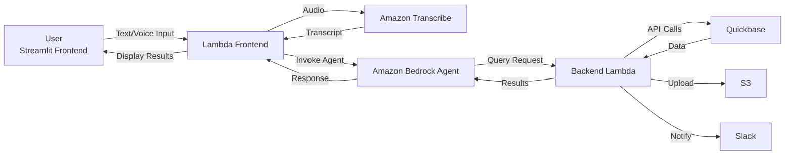

# Quickbase Agent Orchestrator - Architecture

## Overview

This document describes the architecture of the Quickbase Agent Orchestrator system, which enables users to interact with Quickbase data using natural language queries through text or voice input. The system leverages AWS services including Lambda, Bedrock, Transcribe, and S3 to provide a scalable, serverless solution.

## System Architecture Diagram

## Components

### Frontend (Streamlit UI)

- **Purpose**: User-facing interface for conversational queries
- **Features**:
  - Text and voice input support
  - Session management
  - Response display with download links
- **Technology**: Streamlit, Python

### Lambda Frontend

- **Purpose**: API gateway and request orchestration
- **Responsibilities**:
  - Validate demo keys and handle authentication
  - Transcribe audio input using Amazon Transcribe
  - Invoke Bedrock agent with user prompts
  - Return formatted responses to frontend
- **Technology**: AWS Lambda, Python, Amazon Transcribe SDK

### Amazon Bedrock Agent

- **Purpose**: Natural language processing and conversation management
- **Responsibilities**:
  - Parse user intent from natural language
  - Extract parameters (tables, entities, filters, sorting)
  - Coordinate with backend Lambda for data retrieval
  - Generate conversational responses
- **Technology**: Amazon Bedrock

### Backend Lambda

- **Purpose**: Quickbase data operations and business logic
- **Responsibilities**:
  - Validate table names and field access (via allowlist)
  - Execute Quickbase API queries with filters and sorting
  - Format and export data to CSV
  - Handle file attachments (download from Quickbase, upload to S3)
  - Send Slack notifications with summaries
  - Manage caching for performance optimization
- **Technology**: AWS Lambda, Python, Quickbase API

### Quickbase

- **Purpose**: Primary data source
- **Type**: Low-code database platform
- **Access**: RESTful API with user token authentication

### Amazon S3

- **Purpose**: File storage and distribution
- **Usage**:
  - Store CSV exports
  - Host file attachments from Quickbase
  - Generate presigned URLs for secure downloads

### Slack

- **Purpose**: Notifications and reporting
- **Usage**: Send report summaries and download links to configured channels

### Amazon Transcribe

- **Purpose**: Speech-to-text conversion
- **Usage**: Convert voice input to text for processing by Bedrock agent

## Data Flow

1. **User Input**: User submits a query via Streamlit frontend (text or voice)
2. **Request Handling**: Lambda frontend receives the request
3. **Transcription** (if voice): Audio is transcribed to text using Amazon Transcribe
4. **Agent Invocation**: Lambda frontend invokes Bedrock agent with the prompt
5. **Intent Parsing**: Bedrock agent extracts parameters (tables, filters, sorting, etc.)
6. **Backend Query**: Backend Lambda validates and executes Quickbase API queries
7. **Data Processing**: Results are formatted, exported to CSV, and uploaded to S3
8. **Attachments**: File fields are downloaded from Quickbase and uploaded to S3
9. **Notifications**: Summary and links are sent to Slack
10. **Response Generation**: Bedrock agent generates a conversational response
11. **User Display**: Results and download links are displayed in the frontend

## Technology Stack

### AWS Services

- **Lambda**: Serverless compute for frontend and backend logic
- **Bedrock**: Conversational AI and natural language understanding
- **Transcribe**: Speech-to-text conversion
- **S3**: Object storage for exports and attachments
- **CloudWatch**: Logging and monitoring
- **API Gateway**: HTTP endpoint management

### External Services

- **Quickbase**: Primary data source
- **Slack**: Notifications and reporting

### Languages & Frameworks

- **Python**: Primary programming language
- **Streamlit**: Frontend UI framework

## Key Design Features

### Field Allowlist

- Only fields listed in `backend/field_allowlist.py` are queryable
- Supports markers for key fields `[KEY]`, date fields `[DATE]`, relationship fields `[RELATED KEY]`, and unique identifiers `[UNIQUE]`
- Provides security and control over data exposure

### Caching Strategy

- In-memory TTL caches for field maps, relationships, and metadata
- Reduces API calls to Quickbase
- Configurable cache duration via environment variables

### Attachment Handling

- Quickbase file fields are downloaded and re-uploaded to S3
- Presigned URLs provide secure, time-limited access
- Avoids exposing Quickbase authentication

### Error Handling & Retry Logic

- Automatic retry with exponential backoff for API failures
- Graceful degradation for non-critical features
- Comprehensive logging for debugging

## Security Considerations

- **Authentication**: Quickbase user token, AWS IAM roles, demo key validation
- **Data Access**: Field allowlist restricts queryable data
- **File Access**: S3 presigned URLs with expiration
- **Secrets Management**: Environment variables for sensitive credentials
